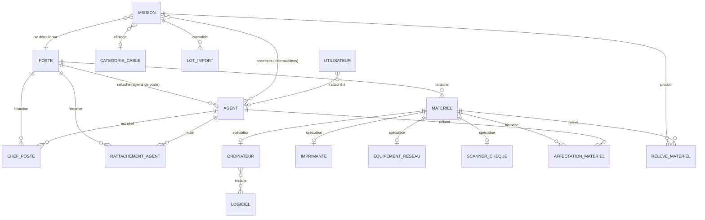

# 04 — Modèle de données

## 1. Diagramme (vue logique)

## 2. Entités principales

| Entité | Table | Clé | Champs notables |
|---|---|---|---|
| Poste (TPR) | `poste` | `id` | code (unique), nom, région |
| Agent | `agent` | `matricule` | nom, prénom, fonction, téléphone, email, type_agent (POSTE/INFORMATICIEN), poste_id |
| ChefPoste *(historisé)* | `chef_poste` | `id` | poste_id, agent_matricule, date_debut, date_fin |
| RattachementAgent *(historisé)* | `rattachement_agent` | `id` | agent_matricule, poste_id, date_debut, date_fin |
| Mission | `mission` | `id` | reference (MIS-AAAA-NNN), objet, date_debut, date_fin, poste_id, chef_mission, chef_poste figé, statut (EN_CONSOLIDATION/CLOTUREE), etat_cablage, categorie_cable_id, observations |
| Matériel | `materiel` | `numero_inventaire` | type, poste_id, nom, modele, statut (EN_SERVICE/EN_PANNE/A_CHANGER), observation, date_creation |
| Ordinateur | `ordinateur` | `numero_inventaire` (= matériel) | mac_ethernet, mac_wifi, nom_machine, ram, processeur, disque_dur, agent installateur/traitant, logiciels (n-n) |
| Imprimante | `imprimante` | idem | mac, mac_wifi, ip |
| EquipementReseau | `equipement_reseau` | idem | mac, ip (switch / access point) |
| ScannerCheque | `scanner_cheque` | idem | numero_serie, marque |
| AffectationMateriel *(historisée)* | `affectation_materiel` | `id` | materiel_numero, agent_matricule, poste_id, date_debut, date_fin |
| ReleveMateriel *(photo datée)* | `releve_materiel` | `id` | mission_id, materiel_numero, agent_saisisseur, zone, source_fichier, date_releve, **etat_observe** |
| Logiciel | `logiciel` | `id` | nom (unique), actif |
| CategorieCable | `categorie_cable` | `id` | libellé (unique) |
| Utilisateur | `utilisateur` | `id` | identifiant, mot de passe (BCrypt), rôle, actif, agent_matricule |
| LotImport | `lot_import` | `id` | mission, fichier (BYTEA), statut (EN_ATTENTE/INTEGRE) |

## 3. Migrations Flyway

| Version | Objet |
|---|---|
| **V1** | Schéma initial (postes, agents, chef de poste, matériel + types, affectations, missions, relevés, référentiels) |
| **V2** | Ordinateur : RAM, processeur, disque dur |
| **V3** | Matériel : statut + observation ; mission : observations |
| **V4** | Table utilisateurs |
| **V5** | Lien compte ↔ agent (matricule), index unique partiel |
| **V6** | Lot d'import (fichier BYTEA) |
| **V7** | Rattachement agent↔TPR historisé (+ reprise des rattachements courants) |
| **V8** | Relevé : colonne `etat_observe` (photo datée des attributs) — idempotente |

Le schéma est **géré exclusivement par Flyway** (`ddl-auto=none`).

## 4. Règles d'intégrité notables

- `agent` : contrainte `type_agent = POSTE ⇒ poste_id NON NULL` ; `INFORMATICIEN ⇒ poste_id NULL`.
- Unicité d'**une seule affectation courante** par matériel (date_fin NULL) — clôture avant ouverture.
- `numero_inventaire` généré par l'application (clé physique d'étiquetage).
- Référentiels : suppression refusée si l'élément est référencé (logiciel installé, catégorie utilisée par une mission).
